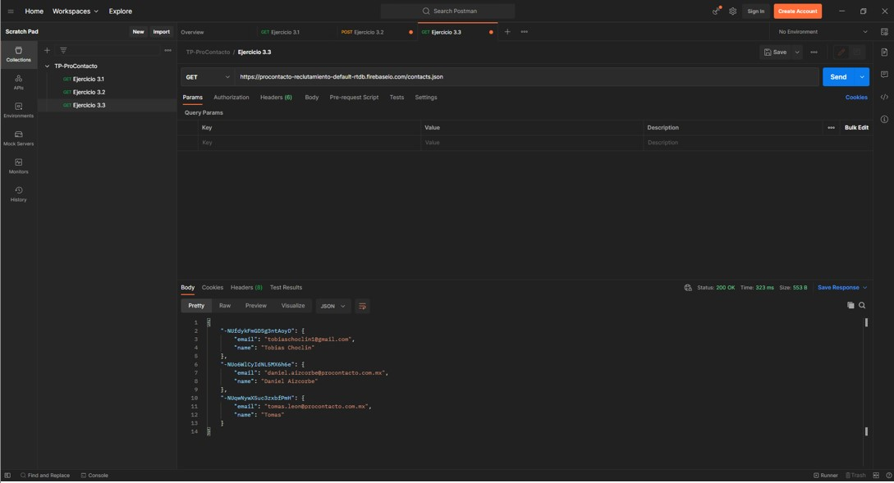

*Tomas Guillermo Leon*

EVALUACIÓN PRÁCTICA
===================

Índice
------

  - [Ejercicio 2](#ejercicio-2)

  - [Ejercicio 3](#ejercicio-3)

  - [Ejercicio 4](#ejercicio-4)
  
  - [Ejercicio 5](#ejercicio-5)

  - [Ejercicio 6](#ejercicio-6)

  - [Ejercicio 7](#ejercicio-7)

___

Ejercicio 2
------------------

1.  ¿Qué es un servidor HTTP?
Un servidor Hypertext Transfer Protocol (HTTP) o en castellano, Protocolo de Transferencia de Hipertexto, es un programa informático utilizado en páginas webs, dónde su trabajo es conectar una "página" con otra (de manera informal), es decir, devolver información cuando recibe peticiones del usuario.

2.  ¿Qué son los verbos HTTP? Mencionar los más conocidos
Los verbos de HTTP es una forma de realizar **peticiones** al servidor. Los más populares son:
    - GET
    - PATCH
    - POST
    - PUT
    - DELETE
    - Hay otros verbos como los son: HEAD, TRACE, OPTIONS y CONNECT

3.  ¿Qué es un request y un response en una comunicación HTTP? ¿Qué son los headers?
Request significa justamente “petición” y response significa “respuesta”. Entonces, un request es el mensaje o petición que envía el cliente, y el servidor, devuelve una respuesta a esta petición por media de un response.
Los headers o cabeceras HTTP son los parámetros que se envían en una petición o respuesta HTTP al cliente o al servidor para proporcionar información esencial sobre la transacción en curso.

4.	¿Qué es un queryString? (En el contexto de una URL)
QueryString significa cadena de consulta, es utilizado para realizar interacciones con una base de datos. En cuanto a la URL, es la parte dónde podemos enviar información al servidor.

5.	¿Qué es el responseCode? ¿Qué significado tiene los posibles valores devueltos?
El responseCode es el código de estado de respuesta HTTP, indica si se ha completado satisfactoriamente una solicitud HTTP específica. Hay distintos valores posibles a devolver, los cuales son:
    •	Respuestas informativas (100–199)
    •	Respuestas satisfactorias (200–299)
    •	Redirecciones (300–399)
    •	Errores de los clientes (400–499)
    •	Errores de los servidores (500–599)

6.	¿Cómo se envía la data en un GET y cómo en un POST?
GET lleva los datos de forma "visible" al cliente. El medio de envío es la URL. Los datos los puede ver cualquiera. Y POST consiste en datos "ocultos", enviados por un formulario cuyo método de envío es post. Los datos no son visibles.

7.	¿Qué verbo http utiliza el navegador cuando accedemos a una página?
Cuando se accede a una página web desde el navegador, se utiliza el verbo HTTP "GET", dicho verbo es el que permite realizar consultas directas al servidor, donde el mismo, otorga una respuesta (en este caso, la visualización de dicha página web). Cabe destacar que el verbo "GET" no causa efectos secundarios en el servidor, no produce nuevos registros ni modifica los existentes.

8. Explicar brevemente qué son las estructuras de datos JSON y XML dando ejemplo de estructuras posibles.
Las estructuras de datos JSON, son cadenas útiles cuando se quiere transmitir datos a través de una red. Las estructuras de datos XML son utilizadas para almacenar e intercambiar datos estructurados.

- Ejemplo JSON:

~~~json
{   "person" :{
    "firstName": "Tomas",
    "lastName": "Leon",
    "loginCount": 4,
    "isWriter": true,
    "worksWith": ["Spantree Technology Group", "InfoWorld"],
    "pets": [
        {
            "name": "Olivia",
            "type": "Dog"
        }
    ]}
}
~~~

- Ejemplo XML:

~~~xml
<?xml version="1.0"?>
<person>
    <first_name>Tomas</first_name>
    <last_name>Leon</last_name>
    <login_count>4</login_count>
    <is_writer>true</is_writer>
    <works_with_entities>
        <works_with>Spantree Technology Group</works_with>
        <works_with>InfoWorld</works_with>
    </works_with_entities>
    <pets>
        <pet>
            <name>Olivia</name>
            <type>Dog</type>
        </pet>
    </pets>
</person>
~~~

9.	Explicar brevemente el estándar SOAP
SOAP es un estándar basado en XML para la transmisión de mensajes en HTTP y otros protocolos de Internet. Es un protocolo ligero para el intercambio de información en un entorno descentralizado y distribuido.

10.	Explicar brevemente el estándar REST Full
RESTful es considerada una técnica de arquitectura de software, es decir, un conjunto de principios y patrones de comunicación que ayudan a crear una forma de pensar y construir las APIs. Este tipo de arquitectura se define por un conjunto de restricciones entre los elementos, componentes, conectores y datos usados.

11. ¿Qué son los headers en un request? ¿Para qué se utiliza el key Content-type en un header?
Los HTTP headers son la parte central de los HTTP requests y responses, y transmiten información acerca del navegador del cliente, de la página solicitada, del servidor, etc.

Ejercicio 3
------------------

1.  Screenshot de la resolución:

2.  Screenshot de la resolución:

3.  Screenshot de la resolución:

La diferencia entre la llamada del punto 1 y la del punto 3, se da cuando se realiza el POST, ya que ahí se ingresa nuestro nombre y email nuestro, el cual lo establecimos en el body del verbo HTTP. Entonces, cuando se realiza el GET nuevamente, en la respuesta se ve reflejado la información que nosotros agregamos, en este caso, nuestro nombre y email.

Ejercicio 4
-----------------

Resolución de los módulos de Trailhead: [Perfil](https://trailblazer.me/id/tomasleon)

Ejercicio 5
------------------

1. **Lead**: Son los candidatos potenciales que demostraron interés en un producto o servicio de la organización. Y sus datos que almacena de forma estándar son:

   - Lead Information: Name, Phone, Mobile, Last Name, Company, Email, Website, Title, Lead Source, Lead Status, Rating, Industry, Annual Revenue, No. of Employees.

   - Adress Information: Street, Zip, City, State/Province, Country.

   - Additional Information: Product Interest, Current Generator(s), SIC Code, Primary, Number of Locations.

   - Description Information: Description.

2. **Account**: Sinónimo de "empresa" u "organización", dónde se encontraran oportunidades, contactos, entre otras cosas. Y sus datos que almacena de forma estándar son:

    - Account Information: Rating, Phone, Fax, Website, Ticker Symbol, Ownership, Employees, SIC Code, Annual Revenue, Industry, Type, Account Site, Account Number, Parent Account, Account Name.

    - Address Information: Billing Address, Shipping Address.

    - Additional Information: Additional Information, SLA, SLA Expiration Date, SLA Serial Number, Number of Locations, Upsell Oportunity, Active.
    - Description Information: Description.

3. **Contact**: Son personas que trabajan al interior de las empresas. Y sus datos que almacena de forma estándar son:

    - Contact Information: Phone, Home Phone, Name, Last Name, Account Name, Mobile, Other Phone, Fax, Email, Assistant, Asst. Phone, Title, Department, Birthdate, Reports To, Lead Source,Loan Amount.

    - Address Information: Mailing Address, Other Address.

    - Additional Information: Languages, Level.

    - Description Information: Description

4. **Opportunity**: Son las potenciales oportunidades de ventas para la oferta de un producto. Y sus datos que almacena de forma estándar son:

   - Opportunity Information: Amount, Close Date, Next Step, Stage, Probability (%), Primary Campaign Source, Lead Source, Type, Account Name, Opportunity Name, Private.

   - Additional Information: Order Number, Main Competitor(s), Delivery/Installation Status, Current Generator(s), Tracking Number.

   - Description Information: Description.

5. **Product**: Es el o los productos que la organización ofrece. Y sus datos que almacena de forma estándar son:

   - Product Information: Product Name, Active, Product Family, Product Code, Product Description.

6. **PriceBook**: Es el objeto que permite crear una lista de precios en sí. Y sus datos que almacena de forma estándar son:

   - PiceBook Information: Price Book Name, Active, Is Standard Price Book, Description.

7. **Quote**: El objeto Quote representa una cotización, muestra los precios propuestos para productos y servicios. Y sus datos que almacena de forma estándar son:

   - Quote Information: Account Name, Additional To, Additional To Name, Bill To, Bill To Name, Contact Name, Contract, Description, Discount, Email, Expiration Date, Fax, Grand Total, Line Items, Opportunity Name, Owner Name, Phone, Quote Name, Quote Number, Quote To, Quote To Name, Shipping and Handling, Ship To, Ship To Name, Status, Subtotal, Syncing, Tax, Total Price.

8. **Asset**: Los activos representan los productos específicos que los clientes han comprado. Y sus datos que almacena de forma estándar son:

   - Asset Information: Asset Name, Account, Contact, Product, Serial Number, Competitor Asset, Purchase Date, Install Date, Status, Usage End Date, Quantity, Price, Description.

9. **Case**: Representa un asunto o un problema del cliente, Y sus datos que almacena de forma estándar son:

   - Case Information: Status, Priority, Case Origin, Contact Name, Account Name, Type, Case Reason, Case Number.

   - Web Information: Web Email, Web Company, Web Phone, Web Name.

   - Additional Information: Product, Engineering Req Number, SLA Violation, Potential Liability.

   - Description Information: Subject, Description, Internal Comments.

10. **Article**: Este objeto se puede utilizar para asociar un artículo con categorías de datos de un grupo de categorías de datos o para consultar las selecciones de categoría de un artículo. Y sus datos que almacena de forma estándar son:

    - Article Information: DataCategoryGroupName, DataCategoryName, ParentId.

**RELACIONES ENTRE LOS OBJETOS**: En base a la observación y el análisis de las relaciones entre los objetos mediante la herramienta Schema Builder de Salesforce, obtuve el siguiente diagrama.

Para poder realizar este diagrama, utilice otro diagrama más extenso y preciso de la relación de objetos estándar de Salesforce. [Sales Cloud Data Model](https://architect.salesforce.com/1/asset/immutable/s/a566708/assets/images/data-models/sales-cloud-overview-data-model.png) y [Product & Price Book Data Model](https://architect.salesforce.com/1/asset/immutable/s/694cdeb/assets/images/data-models/sales-cloud-product-price-book-data-model.png)

Ejercicio 6
------------------

**Soluciones de Salesforce**:

A.	¿Qué es Salesforce?
Es una empresa de software conocida por producir un CRM llamado Sales Cloud

B.	¿Qué es Sales Cloud?
Sales Cloud es una aplicación de Salesforce, basada en la nube, de gestión de las relaciones con los clientes (CRM). Incluye herramientas para la gestión de contactos, la automatización de la fuerza de ventas, la previsión de ventas, así como la productividad.

C.	¿Qué es Service Cloud?
Service Cloud es una solución completa de atención al cliente, creada especialmente para dar soporte a los clientes a cualquier hora y en cualquier lugar, por teléfono, correo electrónico, redes sociales, chats y páginas o comunidades de auto ayuda.

D.	¿Qué es Health Cloud?
Health Cloud es una plataforma especialmente diseñada para la gestión clínica de pacientes por medio de tecnologías on-cloud, la cual ofrece una comunicación más personalizada entre pacientes, miembros, proveedores y prestadores de servicios de salud, y un mejor ajuste a los procesos, servicios y datos médicos según el perfil de cuidado de cada paciente.

E.	¿Qué es Marketing Cloud?
Marketing Cloud es una plataforma de marketing digital de Salesforce que incluye herramientas para el marketing por correo electrónico, el marketing a través de redes sociales, el marketing para dispositivos móviles, la publicidad online y la automatización del marketing.

**Funcionalidades de Salesforce**:

A.	¿Qué es un RecordType?
Los Record Types en Salesforce nos permiten definir diferentes Business Process, Pages Layouts y Picklist Values en un determinado objeto. Así mismo, los Record Types nos ayudan a mostrar distintos tipos de información según el perfil del usuario.

B.	¿Qué es un ReportType?
Un ReportType es una API para obtener información sobre qué tipos de informes están disponibles en una organización.

C.	¿Qué es un Page Layout?
Una Page Layout es la herramienta que te permite controlar la posición y la organización de los campos, y también las listas relacionadas que están visibles a los usuarios, cuando se visualiza un registro.

D.	¿Qué es un Compact Layout?
Un Compact Layout es la herramienta que permite devolver el diseño compacto principal para un conjunto de objetos.

E.	¿Qué es un Perfil?
Un perfil se define como una recopilación de permisos y parámetros.

F.	¿Qué es un Rol?
Los roles controlan el nivel de visibilidad que un usuario tiene sobre los datos de su organización.

G.	¿Qué es un Validation Rule?
Las reglas de validación o Validation Rule, verifican que los datos que un usuario introduce en un registro cumplen con las normas que especifica antes de que el usuario guarde el registro.

H.	¿Qué diferencia hay entre una relación Master Detail y Lookup?
Lookup vinculan dos objetos para poder “buscar” un objeto en los elementos relacionados del otro objeto. Mientras que Master Detail, un objeto es el principal y otro es el detalle. El objeto principal controla determinados comportamientos del objeto de detalle.

I.	¿Qué es un Sandbox?
Un Sandbox es una copia de su organización en un entorno aislado que puede usar para distintos fines, como pruebas y formación.

J.	¿Qué es un ChangeSet?
Un ChangeSet es un conjunto de cambios que se ha enviado desde otra organización de Salesforce a la organización en la que ha iniciado sesión.

K.	¿Para qué sirve el import Wizard de Salesforce?
El Import Wizard permite importar datos de muchos de los objetos estándares de Salesforce, como prospectos, cuentas o contactos; así como de objetos personalizados.

L.	¿Para qué sirve la funcionalidad Web to Lead?
La función Web-to-Lead de Salesforce se puede utilizar para generar información de clientes potenciales a partir de los visitantes del sitio web

M.	¿Para qué sirve la funcionalidad Web to Case?
Web to Case recopila las solicitudes de servicio de atención al cliente directamente del sitio web de una empresa y genera automáticamente "cases" nuevos.

N.	¿Para qué sirve la funcionalidad Omnichannel?
Omnichannel ayuda al enrutamiento automático de diferentes tipos de elementos de trabajo (como casos y clientes potenciales) a los agentes.

O.	¿Para qué sirve la funcionalidad Chatter?
Salesforce Chatter permite a los usuarios colaborar en oportunidades de ventas, casos de servicio, campañas y proyectos con aplicaciones integradas y acciones personalizadas.

**Conceptos generales**:

A.	¿Qué significa SaaS?
Software como servicio (SaaS), es una forma de poner a disposición softwares y soluciones de tecnología por medio de internet, como un servicio. Con este modelo, no se necesita instalar, mantener y actualizar hardwares y softwares.

B.	¿Salesforce es Saas?
SalesForce es SaaS ya que otorga soluciones tecnológicas por medio de la nube en forma de servicio. Como puede ser: Sales Cloud.

C.	¿Qué significa que una solución sea Cloud?
Una solución Cloud es la forma de implementar software en la nube como método resolutivo a ciertas necesidades o problemas.

D.	¿Qué significa que una solución sea On-Premise?
Una solución on-premise significa que la organización mantiene sus propios servidores y hardware, y compra la licencia del software (o lo desarrolla internamente). Esto implica que no son gestionados por un tercero.

E.	¿Qué es un pipeline de ventas?
El pipeline de ventas es una herramienta de gestión que te permite organizar de forma visual y dinámica el flujo de ventas de tu empresa, de manera que sea posible seguir el progreso de los leads a lo largo de las diferentes etapas que componen el proceso de ventas.

F.	¿Qué es un funnel de ventas?
El funnel de ventas es una representación gráfica del "camino" o las etapas por las que pasa un usuario en su proceso para convertirse en un cliente.

G.	¿Qué significa Customer Experience?
La experiencia del cliente (CX) es cómo se relaciona una empresa con sus clientes en todos los aspectos del recorrido de compra, desde el marketing hasta las ventas y el servicio al cliente pasando por cada punto intermedio.

H.	¿Qué significa omnicanalidad?
La omnicanalidad es aquella estrategia de comunicación que mejora la relación empresa-cliente a través de diferentes canales interrelacionados y permite identificar al cliente en los diferentes canales.

I.	¿Qué significa que un negocio sea B2B?¿Qué significa que un negocio sea B2C?¿Qué es un KPI?
El B2B es un modelo de negocio que consiste en los servicios que una compañía entrega a otra con el objetivo de mejorar las ventas de los productos y bienes que ofrece. B2C, es un modelo de negocio en el que una empresa le vende de forma directa al consumidor final. La palabra KPI significa “indicadores claves de desempeño”. Estos indicadores son todas las variables, factores y unidades de medida que sirven para generar una estrategia de marketing.

J.	¿Qué es una API y en qué se diferencia de una Rest API?
Una API es una pieza de código que permite a diferentes aplicaciones comunicarse entre sí y compartir información y funcionalidades. Una API REST es un tipo de API que sigue un conjunto de reglas y estándares que la hacen más fácil de usar y más compatible con otras aplicaciones.

K.	¿Qué es un Proceso Batch?
El procesamiento batch, es el proceso mediante el cual una computadora completa lotes de trabajos, a menudo simultáneamente, en orden secuencial y sin parar. Se caracterizan porque su ejecución no precisa ningún tipo de interacción con el usuario.

L.	¿Qué es Kanban?
Kanban es una metodología que ayuda a los equipos a encontrar un equilibrio entre el trabajo que necesitan hacer y la disponibilidad de cada miembro. El objetivo es gestionar de manera general cómo se van completando las tareas.

M.	¿Qué es un ERP?
ERP (Sistema de planificación de recursos empresariales) es un software de gestión empresarial que permite a una organización utilizar un sistema de aplicaciones integradas para gestionar cuentas e integrar las actividades financieras, de cadena de suministro, de operaciones, de creación de informes, de fabricación y de recursos humanos de una empresa.

N.	¿Salesforce es un ERP?
SalesForce es un ERP ya que comparte la misma base de datos independientemente del área que trabaje con los mismos en una misma organización. Además, permite la comunicación entre ellos, de esta manera, otorgando mejores resultados a futuro.

Ejercicio 7
------------------

